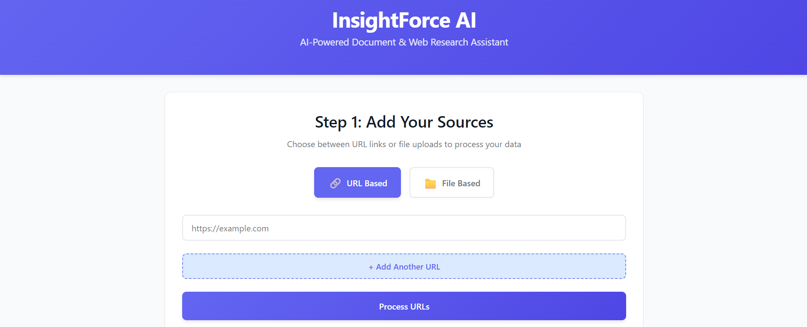
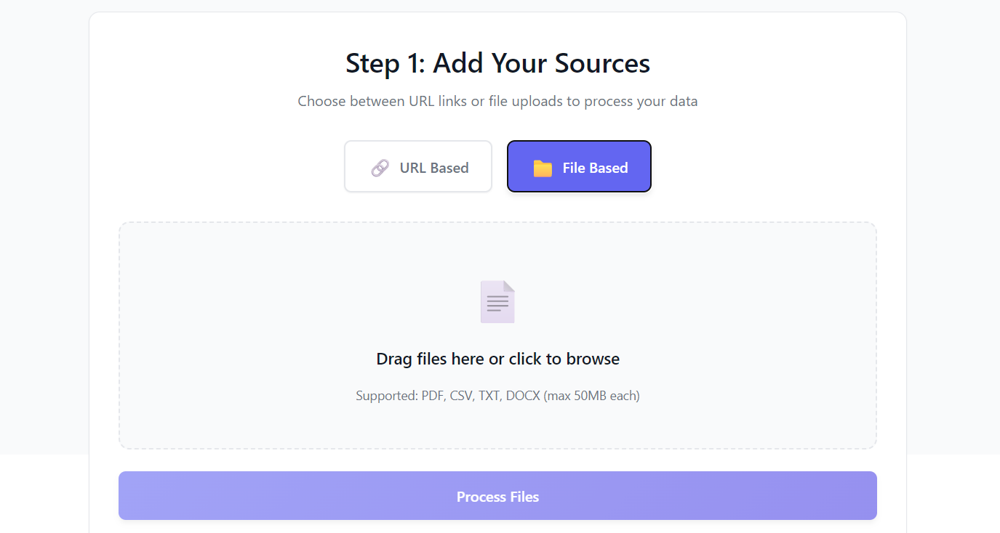

InsightForce AI
===============

Overview (Why)
--------------
InsightForce is an AI-powered document and web research assistant. It ingests URLs or uploaded files, embeds them into a FAISS vector store using OpenAI embeddings, and answers user questions with cited sources. This shortens research time by consolidating source processing and retrieval into one flow.

Screenshot
----------

, [screenshot/insightforce2.png](screenshot/insightforce2.png)

Folder Structure
----------------
- backend/
	- app/main.py           FastAPI app (ingestion, QA, reset)
	- faiss_store/          Persisted FAISS index
	- temp_files/           Uploaded files (ephemeral)
	- requirements.txt      Python dependencies
- frontend/
	- src/                  React + Vite + TS UI
	- public/               Static assets
	- package.json          Frontend deps/scripts

Setup
-----
Backend
- Prereqs: Python 3.10+
- Commands:
	- `cd backend`
	- (optional) `python -m venv venv` then `venv\Scripts\activate`
	- `pip install -r requirements.txt`
	- create `.env` with `OPENAI_API_KEY=...`
	- Run dev server: `uvicorn app.main:app --reload --host 0.0.0.0 --port 8000`
	- Docs: http://localhost:8000/docs

Frontend
- Prereqs: Node 18+
- Commands:
	- `cd frontend`
	- `npm install`
	- (optional) create `.env` with `VITE_API_URL=http://localhost:8000`
	- Run dev server: `npm run dev` (default http://localhost:5173)

Usage Flow
----------
1) Pick URL or File tab and process sources.
2) After success, ask questions in the QA section.
3) Use Reset to clear FAISS index and temp files when starting over.
